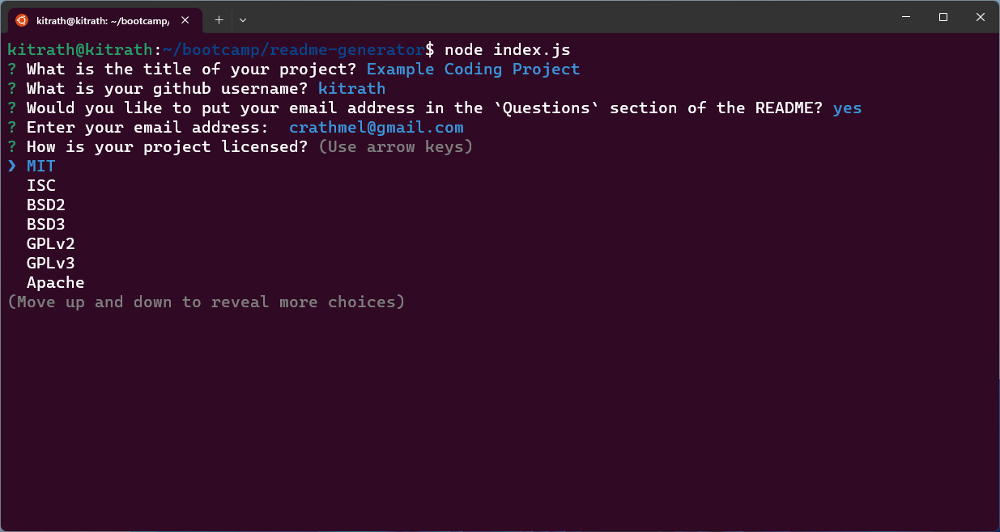

# README Generator

## Description
Generates a `README.md` file from a series of prompts at the command line.  Application prompts for project title, a description, developer's GitHub username, and an optional password. Generated README displays a license badge, and automatically generates a link to an online version of your project's chosen license.  Additionally, your generated file contains a linked table of contents to the following headings: Installation, Usage, License, Contributing, Tests, and Questions.  
**Brief walk-through video: [README Generator Screencast](https://watch.screencastify.com/v/60LUCHEM9sukGoCGmvpo)**
## Installation
1. Clone this repository: `git clone git@github.com:kitrath/readme-generator.git`
2. Navigate to the base directory: `cd readme-generator`
3. Install dependencies: `npm install`
## Usage
Navigate to the `readme-generator/` directory and run `node index.js`.  You will be asked a series of questions from the command-line that will help you generate a README file for your project.  If you want to generate a skeleton README file, you may skip (press ENTER) the Description, Installation, Usage, Contributing, Questions, and Tests portions of the command-line survey.  Your generated README file will contain headings for each of these, but you can fill in these sections from within your editor of choice after the application generates your file.  *The generated file will be found at `./build/README.md`.*
## Sreenshot

